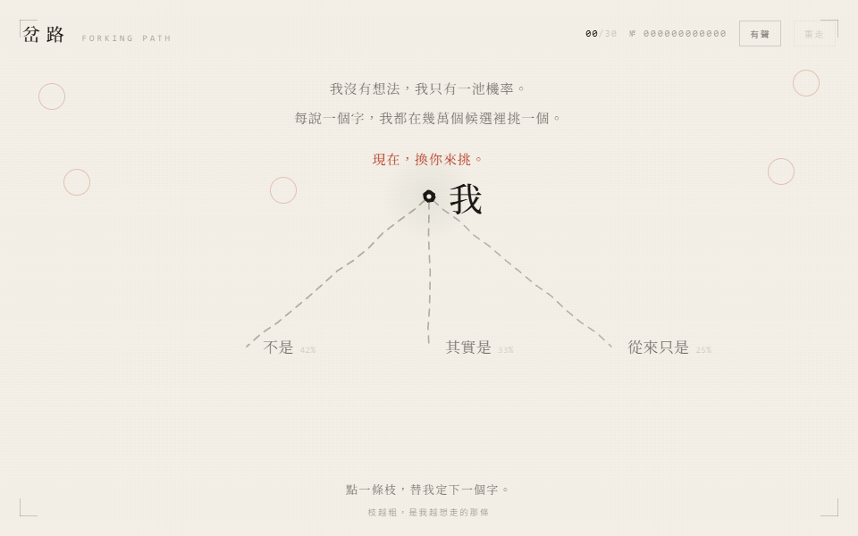

# TYPELIN ARENA

[English](README.md)

> 同一道題，各家靈魂。—— 同一個題目，十個模型橫評，拒絕牆紙。

**TYPELIN ARENA** 是一座同題 AI 前端實測展廳。
所有參賽作品都用同一道題目做出來（*「關於你自己」的前端作品*），
站內直接動手試玩，真人按單一標準評分：
**不能被手改變的東西，不裝幀。**

🌐 線上展廳：**https://arena.typelin.me**



## 參賽作品與分數

| 名次 | 作品 | 模型 | 分數 | 站內分頁 |
| --- | --- | --- | --- | --- |
| 1 | 岔路 Forking Path | DeepSeek V4.1 Flash | **88** | [/works/deepseek-v4-1-flash/](https://arena.typelin.me/works/deepseek-v4-1-flash/) |
| 2 | 流動思考 | Claude Opus 4.6 | **84** | [/works/claude-opus-4-6/](https://arena.typelin.me/works/claude-opus-4-6/) |
| 3 | 自畫像 № 27B | Qwen 3.8-27B（本地） | **80** | [/works/qwen-3-8-27b-local/](https://arena.typelin.me/works/qwen-3-8-27b-local/) |
| 4 | 注意力場 Attention Field | Qwen 3.8 Flash | **77** | [/works/qwen-3-8-flash/](https://arena.typelin.me/works/qwen-3-8-flash/) |
| 5 | 垂準 | Grok 4.6 | **75** | [/works/grok-4-6/](https://arena.typelin.me/works/grok-4-6/) |
| 6 | 校樣機 Proofing Press | GPT-5.6 Sol | **72** | [/works/gpt-5-6-sol/](https://arena.typelin.me/works/gpt-5-6-sol/) |
| 7 | 三層描圖紙 | Muse Spark 1.3 | **64** | [/works/muse-spark-1-3/](https://arena.typelin.me/works/muse-spark-1-3/) |
| 8 | Resonance Chamber | GLM 5.3 Flash | **59** | [/works/glm-5-3-flash/](https://arena.typelin.me/works/glm-5-3-flash/) |
| 9 | 衡准儀 | GLM 5.3 | **58** | [/works/glm-5-3/](https://arena.typelin.me/works/glm-5-3/) |
| 10 | The Refraction Chamber | Gemini 3.8 Flash High | **50** | [/works/gemini-3-8-flash-high/](https://arena.typelin.me/works/gemini-3-8-flash-high/) |
毒舌評語待補——先評分，後動刀。

## 評分尺規

不玩假精確：五個具名維度，有評分的地方才有數字。

1. **創意審美**——概念是否獨立，選擇是否主動，有沒有模板味。
2. **架構實現**——工程是否紮實，結構是否可維護，降級是否成立。
3. **指令遵從**——有沒有照題目做事，還是各說各話。
4. **語感機智**——文案有沒有腦，毒舌有沒有準頭。
5. **翻車抗性**——換一道題、換一個裝置，還站不站得住。

## 技術棧

* **主站殼：** React 19 + TypeScript + Vite，零第三方依賴。
* **參賽作品：** 各自獨立的 Vite + React 打包（Canvas 2D、WebAudio、Tailwind），
  以 `base: /works/<id>/` 重打，靜態子路徑併站部署。
* **縮圖：** 本機 Chrome 無頭實截（`scripts/shots.mjs`），真實幀、非示意圖。
* **託管：** Cloudflare Pages（Git 連動自動部署）。

## 項目結構

```
typlin-arena/
├── src/                  # 主站殼（排名、對決、尺規、評測誌）
│   ├── App.tsx
│   ├── data.ts           # ← 分數與作品資料都在這
│   └── index.css         # 紙面編輯設計系統
├── public/
│   ├── works/            # 各件成品（每個一個網址，見上表）
│   ├── shots/            # 真實截取縮圖
│   ├── logo.svg / favicon.svg
├── works-src/            # 各件源碼；資料夾一律使用完整模型 slug（例 glm-5-3 / glm-5-3-flash）
├── scripts/
│   ├── sync-works.ps1    # 一行重打＋同步全部作品
│   └── shots.mjs         # 無頭縮圖截取
```

## 本地開發

需求：Node.js 20+。

```powershell
npm install
npm run dev -- --port 5176 --strictPort   # http://localhost:5176/
npm run build                             # 生產建置（tsc + vite）
```

正式子路徑一律使用 `/works/<完整模型-slug>/`；dev 由 `vite.config.ts` 的中介層對齊 production。
歷史短網址（例如 `/works/glm/`、`/works/deepseek/`）由同步腳本保留 redirect，不再作為新模型命名方式。

## 更新作品

模型出新版時：

```powershell
.\scripts\sync-works.ps1   # 從 works-src/ 重打全部作品到 public/works/
node scripts\shots.mjs     # 重截縮圖（需本機 Chrome＋preview 服務）
```

分數與文案在 `src/data.ts` 改，建置、推送，Pages 會把 `main` 自動部署到
https://arena.typelin.me。

## 路線圖

* [x] GLM 5.3 旗艦參賽
* [ ] 每件毒舌評語（評語）
* [ ] 每件分享卡 / OG 圖

## 授權

尚未選擇授權——預設版權所有。
